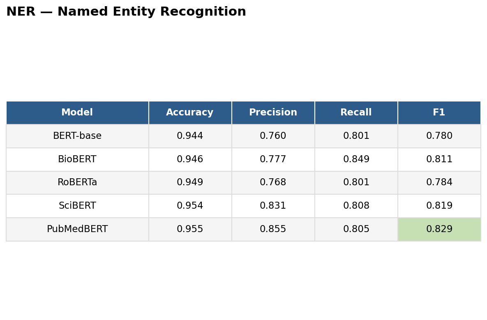
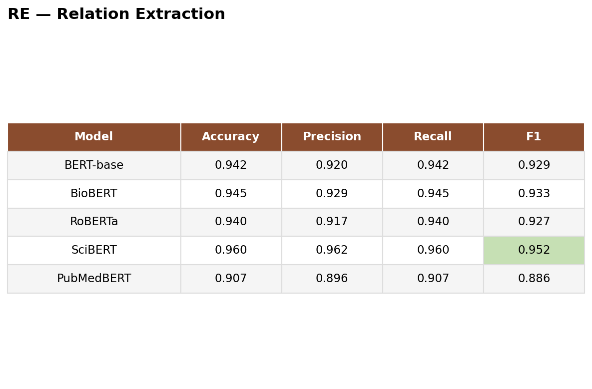

# Pharmacovigilance — Joint BioBERT Framework for Drug Safety

## Overview

This project builds a multi-task deep learning system for automated
pharmacovigilance — detecting drug-disease and drug-side-effect relationships
directly from biomedical text. A shared transformer backbone is jointly
fine-tuned with a named entity recognition (NER) head and a relation
extraction (RE) head, so entity detection and relationship classification
learn from shared context instead of running as disconnected stages.

The extracted relationships will be fused with curated structured safety
databases (SIDER, OnSIDES, DrugBank) into a knowledge graph, ranked by an
evidence-based scoring engine, and explained through an explainable AI layer —
surfaced through an advisory interface where a user looks up either a disease
(to get ranked drug recommendations) or a drug (to get its side-effect profile
and safer alternatives).

## Model comparison

A core contribution of this project is a fair, controlled comparison across
5 transformer backbones, all sharing the identical NER+RE architecture and
training procedure — isolating pretraining domain as the one variable that
changes between runs.

- **BERT-base** — general-purpose baseline, pretrained on Wikipedia and
  BookCorpus, no biomedical exposure. Establishes the lower bound for
  transformer performance on this task.
- **RoBERTa** — general-purpose, trained with a larger corpus and refined
  pretraining recipe than BERT. Tests whether a stronger general-domain
  model can close the gap without biomedical data.
- **SciBERT** — pretrained on scientific literature broadly, not biomedical
  specifically. Tests a partial domain shift.
- **PubMedBERT** — pretrained from scratch on biomedical text (PubMed
  abstracts and full text), no general-domain pretraining at all.
- **BioBERT** — the proposed model, continued-pretrained from general BERT
  on PubMed and PMC full-text articles, combining general language
  understanding with biomedical specialization.

## Experimental Results & Benchmark Analysis

### 1. Named Entity Recognition (NER)

  

* **Top Performer:** **PubMedBERT** achieved the highest overall performance with an **F1 score of 0.829**, an **Accuracy of 95.5%**, and the highest **Precision at 85.5%**, demonstrating superior domain adaptation on biomedical entity boundaries.
* **Domain-Specific Advantage:** Specialized biomedical models (**PubMedBERT**, **SciBERT**, and **BioBERT**) consistently outperformed general-purpose transformers (**BERT-base** at 0.780 F1 and **RoBERTa** at 0.784 F1).
* **Recall vs. Precision:** **BioBERT** achieved the highest overall recall (**84.9%**), making it effective for minimizing false negatives in medical entity extraction, whereas **PubMedBERT** maintained the cleanest signal-to-noise ratio.

---

### 2. Relation Extraction (RE)

  

* **Top Performer:** **SciBERT** demonstrated the best overall relation extraction capability, leading across all metrics with an **F1 score of 0.952**, **Precision of 96.2%**, **Recall of 96.0%**, and **Accuracy of 96.0%**.
* **Model Comparison:** **BioBERT** also delivered strong performance with a **0.933 F1 score**, outperforming the general **BERT-base** (**0.929**) and **RoBERTa** (**0.927**).
* **Scientific Corpus Generalization:** The scientific domain pre-training of **SciBERT** proved significantly more effective for semantic relationship mapping between extracted entities compared to PubMedBERT (0.886 F1) in this benchmark.

---

## Completed So Far

- Unified preprocessing pipeline merging three biomedical text corpora (BC5CDR, BioRED, ADE Corpus) into a standardized schema with normalized entity and relation labels.
- Classical TF-IDF + Linear SVM baseline implemented to benchmark dataset quality prior to deep learning experiments.
- Shared joint NER + RE model architecture developed for modular evaluation across transformer backbones.
- Completed training and evaluation of all 5 comparative transformer architectures (BERT-base, RoBERTa, SciBERT, PubMedBERT, BioBERT) on the held-out test set:
  - **Named Entity Recognition (NER):** **PubMedBERT** achieved the top performance (**0.829 F1**, **0.855 Precision**), with **BioBERT** providing maximum entity sensitivity (**0.849 Recall**).
  - **Relation Extraction (RE):** **SciBERT** achieved the leading performance across all metrics (**0.952 F1**, **0.962 Precision**, **0.960 Recall**).
- Generated and documented comparative evaluation tables and benchmark visualizations.

---

## Next Steps / Upcoming Work

- **Knowledge Base Creation:** Build a PostgreSQL database to store structured biomedical entity and relation data.
- **Knowledge Graph Construction:** Implement a Neo4j graph database to detect entity overlaps and serve as the ground truth reference for drug-disease-side effect relationships.
- **UI & FastAPI Development:** Build an interactive user interface connected via FastAPI to query drugs for their side effects, or search diseases to retrieve indicated drugs along with their side effects.
